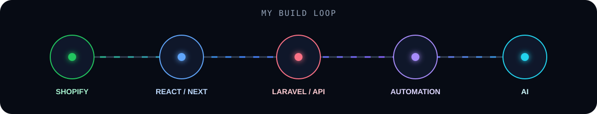

<p align="center">
  
</p>

<p align="center">
  <a href="https://git.io/typing-svg">
    
  </a>
</p>

<p align="center">
  <a href="https://wajahatalinaqvi.github.io">
    
  </a>
  <a href="https://github.com/wajahatalinaqvi?tab=repositories">
    
  </a>
  <a href="mailto:wajahatalinaqvi929@gmail.com">
    
  </a>
  
</p>

<h3 align="center">Commerce-first. Product-minded. Always building.</h3>

<p align="center">
  <b>Shopify apps</b> · <b>Custom storefronts</b> · <b>React / Next.js</b> · <b>Laravel</b> · <b>APIs</b> · <b>Automation</b> · <b>AI workflows</b>
</p>

---

## ⚡ BUILD MODE

I’m a **Shopify-focused full-stack developer** who likes solving the part of a product that actually makes it useful — not just the screen people see.

I work across **storefront UX, embedded apps, backend systems, integrations, queues, dashboards, automation, and AI-assisted workflows**.

<p align="center">
  
</p>

```text
idea → UX → frontend → API → data → automation → ship
```

> **Current direction:** Full-stack product engineering with deep Shopify expertise, strong React/Laravel foundations, and practical AI integrations.

---

## 🚀 FEATURED BUILDS

<table>
<tr>
<td width="50%" valign="top">

### [LinkedIn Pro Agent](https://github.com/wajahatalinaqvi/linkedin-pro-agent)

A priority-driven content system that researches verified tech stories, scores them, prepares LinkedIn + X content, generates previews, and keeps final publishing under human approval.

**Stack:** Python · GitHub Actions · Playwright · LinkedIn API · content scoring · V3 carousel rendering

</td>
<td width="50%" valign="top">

### [Shopify Customer Wishlist API](https://github.com/wajahatalinaqvi/brainxTest-wishlist-app)

A lightweight Shopify wishlist backend that stores customer wishlists directly in **Shopify metafields** and resolves saved products through the Admin API.

**Stack:** Node.js · Express · Shopify Admin API · Netlify Functions · Liquid

</td>
</tr>

<tr>
<td width="50%" valign="top">

### [quickdebugger](https://github.com/wajahatalinaqvi/quickdebugger)

A small developer utility for wrapping async functions and surfacing **execution time, memory usage, and error traces** during debugging.

**Stack:** JavaScript · Node.js · React-friendly instrumentation

</td>
<td width="50%" valign="top">

### [DjordanMedia v2](https://github.com/wajahatalinaqvi/DjordanMedia-v2)

Shopify theme development with custom **Liquid sections, snippets, templates, assets, and storefront UX**.

**Stack:** Shopify Liquid · JavaScript · CSS · Theme architecture

</td>
</tr>
</table>

---

## 🧰 STACK I REACH FOR

<p align="center">
  
</p>

<p align="center">
  
  
  
  
  
  
  
</p>

---

## 🧠 WHAT I LIKE BUILDING

| 🛍️ Commerce | 🧩 Product Engineering | 🤖 AI + Automation |
|---|---|---|
| Shopify apps | React / Next.js interfaces | Research & content agents |
| Theme architecture | Laravel APIs | Human-in-the-loop workflows |
| Checkout / post-purchase UX | Dashboards & admin systems | AI-assisted analysis |
| Storefront performance | Webhooks, queues & integrations | Tool orchestration |

---

## 📊 GITHUB SIGNAL

<p align="center">
  
  
</p>

<p align="center">
  
</p>

---

## 🐍 CONTRIBUTION FLOW

<p align="center">
  <picture>
    <source media="(prefers-color-scheme: dark)" srcset="https://raw.githubusercontent.com/wajahatalinaqvi/wajahatalinaqvi/output/github-contribution-grid-snake-dark.svg" />
    <source media="(prefers-color-scheme: light)" srcset="https://raw.githubusercontent.com/wajahatalinaqvi/wajahatalinaqvi/output/github-contribution-grid-snake.svg" />
    
  </picture>
</p>

---

## 🎯 HOW I BUILD

```text
01  Understand the business problem.
02  Make the UX feel obvious.
03  Keep the architecture maintainable.
04  Automate repetitive work.
05  Measure what actually matters.
06  Ship — then improve.
```

---

## 🤝 LET'S BUILD SOMETHING USEFUL

If you’re working on a **Shopify app, ecommerce experience, React/Laravel product, or AI-powered workflow**, I’m interested in solving the hard part — not just making the interface look finished.

<p align="center">
  <a href="https://wajahatalinaqvi.github.io">
    
  </a>
  <a href="https://github.com/wajahatalinaqvi?tab=repositories">
    
  </a>
</p>

<p align="center">
  <sub>Shopify • Full-stack • AI • Automation</sub>
</p>
